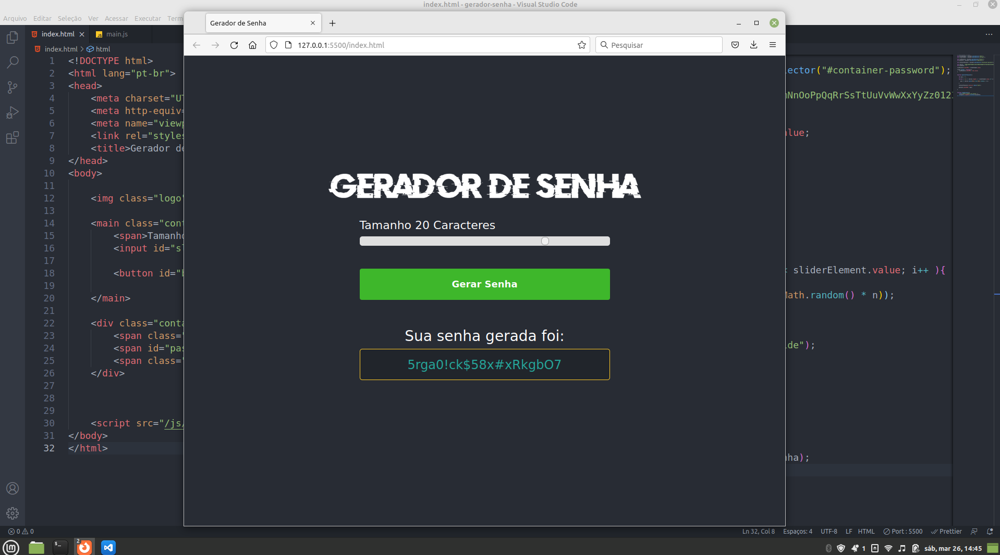

# Desenvolvimento de um Gerador de Senha

### Referência do Projeto Original
- Matheus Canal Sujeito programador - https://www.youtube.com/watch?v=i6t2jaRxos4

 Desenvolvimento com o objetivo de fixar o conhecimento das tecnologias HTML, CSS e JavaScript.
 
 ## Estrutura do Curso
 
